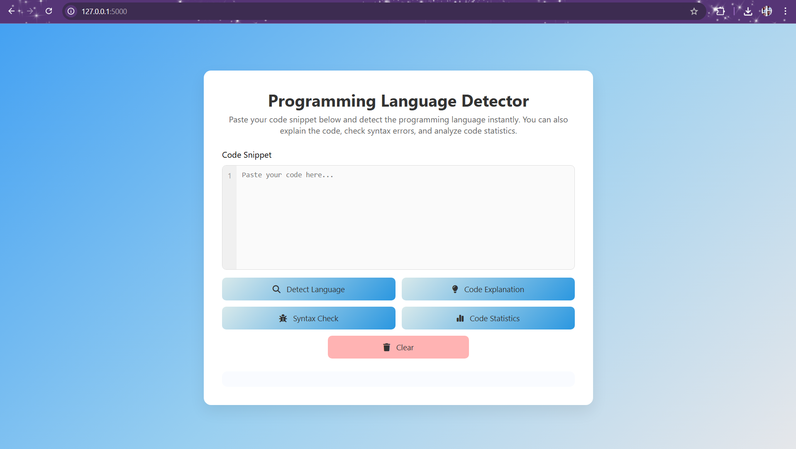
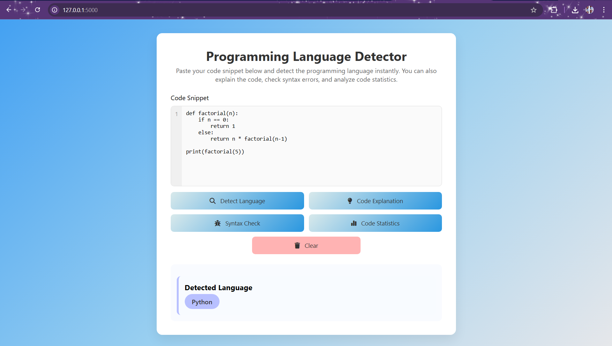
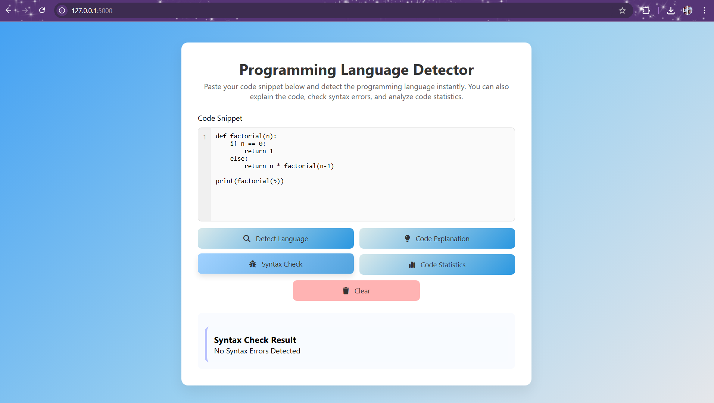
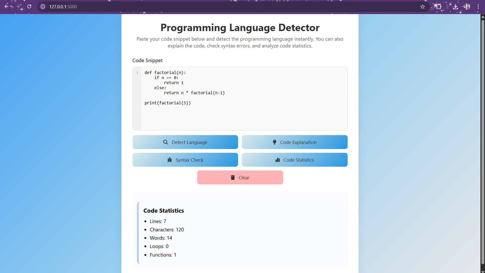

# 🚀 Programming Language Detector

A web application that detects the **programming language of a given code snippet** and provides additional analysis such as **code explanation, syntax checking, and code statistics**.

This project combines **Machine Learning and Web Development** to create an interactive tool for analyzing code snippets.

---

# 📌 Features

### 🔍 Programming Language Detection

Detects the programming language from a pasted code snippet.

### 💡 Code Explanation

Provides a simple explanation of what the code is doing.

### 🐞 Syntax Error Detection

Checks for possible syntax errors in the code.

### 📊 Code Statistics

Shows useful information about the code such as:

* Number of lines
* Characters
* Words
* Loops
* Functions

### 🎨 Interactive User Interface

A clean and modern interface built using **HTML and CSS**.

---

# 🧠 System Workflow

```
User Code Snippet
        ↓
Text Preprocessing
        ↓
TF-IDF Vectorization
        ↓
Machine Learning Model
(Naive Bayes Classifier)
        ↓
Programming Language Prediction
        ↓
Additional Analysis
• Code Explanation
• Syntax Checking
• Code Statistics
```

---

# 🏗 System Architecture

```
           +----------------------+
           |  User Code Snippet   |
           +----------+-----------+
                      |
                      v
           +----------------------+
           |   Text Preprocessing |
           +----------+-----------+
                      |
                      v
           +----------------------+
           |  TF-IDF Vectorizer   |
           +----------+-----------+
                      |
                      v
           +----------------------+
           |  Naive Bayes Model   |
           | Language Prediction  |
           +----------+-----------+
                      |
                      v
           +----------------------+
           |  Result Display UI   |
           |  - Language          |
           |  - Explanation       |
           |  - Syntax Check      |
           |  - Statistics        |
           +----------------------+
```

---

# 📓 Model Training (Google Colab)

The machine learning model used in this project was trained using **Google Colab**.

Training steps include:

* Dataset preparation
* Text preprocessing
* TF-IDF vectorization
* Training a Naive Bayes classifier
* Exporting trained files (`model.pkl` and `vectorizer.pkl`)

Notebook included in this repository:

```
language_detector_training.ipynb
```

---

# ⚙️ Installation

### Clone the repository

```
git clone https://github.com/Roshinibotta/programming-language-detector.git
```

### Move into the project folder

```
cd programming-language-detector
```

### Install required libraries

```
pip install -r requirements.txt
```

### Run the application

```
python app.py
```

Open your browser and go to:

```
http://127.0.0.1:5000
```

---

# 📁 Project Structure

```
programming-language-detector
│
├── app.py
├── programming.csv
├── model.pkl
├── vectorizer.pkl
├── language_detector_training.ipynb
│
├── templates
│   └── index.html
│
├── static
│   └── style.css
│
├── screenshots
│   ├── main_interface.png
│   ├── language_detection.png
│   ├── code_explanation.png
│   ├── syntax_check.png
│   └── code_statistics.png
│
├── requirements.txt
└── README.md
```

---

# 📷 Project Screenshots

<p align="center">
  
  
</p>

<p align="center">
  
  
</p>

<p align="center">
  
</p>

---

# 🛠 Technologies Used

* Python
* Flask
* Machine Learning
* Scikit-learn
* TF-IDF Vectorization
* Naive Bayes Classifier
* HTML
* CSS

---

# 👩‍💻 Author

**Roshini Botta**

B.Tech Student
Gayatri Vidya Parishad College of Engineering for Women

---


